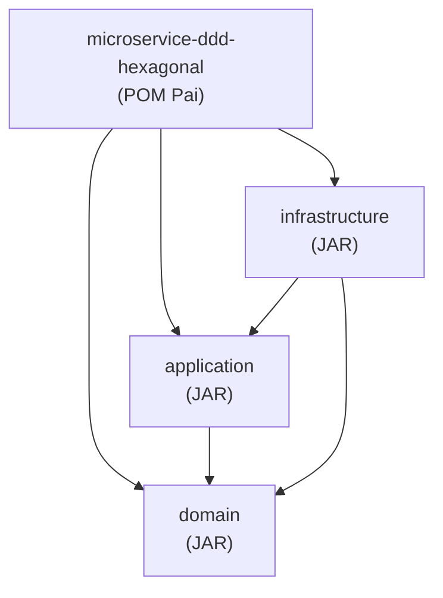
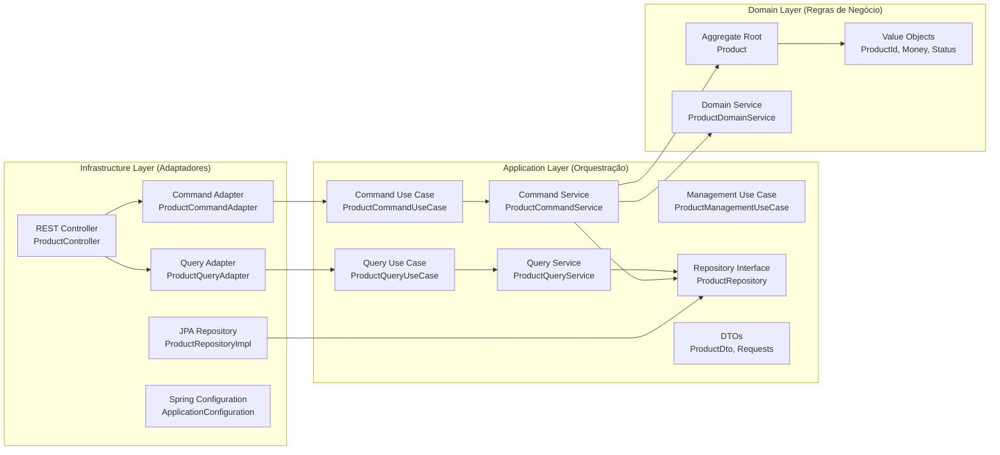
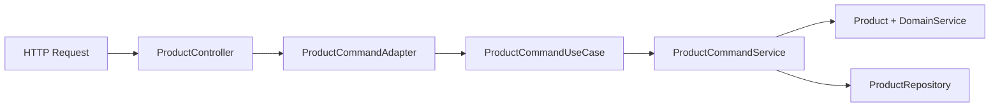

# Microserviço com Spring Boot, DDD e Arquitetura Hexagonal


Este projeto demonstra a implementação de um microserviço utilizando Spring Boot, princípios de Domain-Driven Design (DDD) e Arquitetura Hexagonal, organizado em módulos Maven separados.

## Estrutura do Projeto

O projeto está dividido em três módulos principais:

```
microservice-ddd-hexagonal/
├── pom.xml                           # POM pai do projeto
├── domain/                           # Módulo de Domínio
│   ├── pom.xml
│   └── src/main/java/com/example/domain/
│       ├── model/                    # Entidades e Value Objects
│       │   ├── Product.java          # Agregado raiz
│       │   ├── ProductId.java        # Value Object para ID
│       │   ├── ProductStatus.java    # Enum de status
│       │   └── Money.java            # Value Object para valores monetários
│       └── service/                  # Serviços de domínio puros
│           └── ProductDomainService.java
├── application/                      # Módulo de Aplicação
│   ├── pom.xml
│   └── src/main/java/com/example/application/
│       ├── service/                  # Serviços de aplicação (CQRS)
│       │   ├── ProductCommandService.java      # Serviço de comandos
│       │   └── ProductQueryService.java        # Serviço de consultas
│       ├── dto/                      # Objetos de transferência de dados
│       │   ├── ProductDto.java
│       │   ├── CreateProductRequest.java
│       │   └── UpdateProductRequest.java
│       ├── usecase/                  # Interfaces de casos de uso (Portas de Entrada)
│       │   ├── ProductCommandUseCase.java      # Comandos (CQRS)
│       │   └── ProductQueryUseCase.java        # Consultas (CQRS)
│       └── repository/               # Interfaces de repositório (Portas de Saída)
│           └── ProductRepository.java
└── infrastructure/                   # Módulo de Infraestrutura
    ├── pom.xml
    └── src/main/
        ├── java/com/example/infrastructure/
        │   ├── MicroserviceApplication.java  # Classe principal do Spring Boot
        │   ├── configuration/
        │   │   └── ApplicationConfiguration.java
        │   └── adapter/
        │       ├── web/                      # Adaptadores web (Adaptadores Primários)
        │       │   ├── ProductController.java
        │       │   ├── ProductCommandAdapter.java    # Adaptador de comandos
        │       │   └── ProductQueryAdapter.java      # Adaptador de consultas
        │       └── persistence/              # Adaptadores de persistência (Adaptadores Secundários)
        │           ├── ProductJpaEntity.java
        │           ├── ProductJpaRepository.java
        │           └── ProductRepositoryImpl.java
        └── resources/
            ├── application.yml               # Configurações de desenvolvimento
            ├── application-prod.yml          # Configurações de produção
            └── data.sql                      # Dados de exemplo
```

## Relações de Dependência entre Módulos

### Diagrama de Dependências Maven



### Fluxo de Dependências (Arquitetura Hexagonal + CQRS)



### Regras de Dependência

#### ✅ **Dependências Permitidas:**

**1. Infrastructure → Application**
- `ProductController` depende de `ProductCommandUseCase` e `ProductQueryUseCase`
- `ProductCommandAdapter` implementa `ProductCommandUseCase`
- `ProductQueryAdapter` implementa `ProductQueryUseCase`
- `ApplicationConfiguration` configura beans da aplicação

**2. Infrastructure → Domain**
- `ProductRepositoryImpl` implementa `ProductRepository`
- `ProductJpaEntity` mapeia para `Product`
- Spring Boot starter executa a partir da infraestrutura

**3. Application → Domain**
- `ProductCommandService` e `ProductQueryService` usam `Product`, `ProductDomainService`
- `ProductDto` converte de/para entidades do domínio
- Use cases orquestram operações do domínio
- **Nota**: Repository interface (`ProductRepository`) está na camada de aplicação, não no domínio

#### ❌ **Dependências Proibidas:**

**1. Domain → Application** (NUNCA)
- Domínio não pode conhecer camada de aplicação
- Mantém pureza das regras de negócio

**2. Domain → Infrastructure** (NUNCA)
- Domínio não pode depender de frameworks
- Inversão de dependência através de interfaces

**3. Application → Infrastructure** (NUNCA)
- Aplicação não pode conhecer detalhes de implementação
- Usa abstrações (ports) definidas na própria camada

### Benefícios desta Estrutura

**1. Inversão de Dependências**
```
Infraestrutura ──► Aplicação ──► Domínio
     |                            ↑
     └────────────────────────────┘
```
- Fluxo de controle: Infrastructure → Application → Domain
- Fluxo de dependências: Infrastructure → Application → Domain
- Domain define interfaces, Infrastructure implementa

**2. Isolation por Camadas**
- **Domain**: Zero dependências externas, apenas Java puro
- **Application**: Depende apenas do Domain + Spring Context
- **Infrastructure**: Depende de Application, Domain + Frameworks

**3. Facilita Testes**
- Domain: Testes unitários puros
- Application: Mocks de repositories
- Infrastructure: Testes de integração

## Conceitos Implementados

### Command Query Responsibility Segregation (CQRS)

**CQRS** é um padrão arquitetural que separa as operações de leitura (queries) das operações de escrita (commands), permitindo otimizações específicas para cada tipo de operação.

#### **Implementação CQRS:**

**1. Command Side (Lado dos Comandos)**
- **`ProductCommandUseCase`**: Interface para operações de escrita
- **`ProductCommandService`**: Implementação de serviços de comando
- **`ProductCommandAdapter`**: Adaptador específico para comandos
- Operações: criar, atualizar, adicionar/remover estoque, ativar/desativar

**2. Query Side (Lado das Consultas)**
- **`ProductQueryUseCase`**: Interface para operações de leitura
- **`ProductQueryService`**: Implementação de serviços de consulta
- **`ProductQueryAdapter`**: Adaptador específico para consultas
- Operações: buscar por ID, listar todos, buscar por nome, estatísticas

**Arquitetura CQRS Pura:**
- **`ProductController`**: Utiliza diretamente os adaptadores de comando e consulta
- **Separação clara**: Commands e Queries são tratados por interfaces e adaptadores distintos
- **Otimização independente**: Cada lado pode ser otimizado para sua responsabilidade específica

### Domain-Driven Design (DDD)

**DDD** é uma abordagem de desenvolvimento de software que coloca o foco no domínio central e na lógica de domínio, baseando o design em um modelo do domínio.

#### **Conceitos DDD Implementados:**

**1. Aggregate Root (Agregado Raiz)**
- **`Product`**: Entidade principal que mantém consistência e controla acesso ao agregado
- Encapsula regras de negócio e invariantes (validações de estoque, transições de estado)
- Único ponto de entrada para modificações no agregado
- Controla o ciclo de vida e estado do produto

**2. Value Objects**
- **`ProductId`**: Identifica unicamente um produto, imutável e sem identidade própria
- **`Money`**: Representa valores monetários com validações, encapsula moeda e valor
- **`ProductStatus`**: Enum que representa estados válidos do produto (ACTIVE, INACTIVE, DISCONTINUED)
- Características: imutáveis, comparados por valor, não possuem identidade

**3. Repository Interface (Porta de Saída)**
- **Interface `ProductRepository`**: Definida na camada de aplicação, abstrai persistência
- **Implementação `ProductRepositoryImpl`**: Na infraestrutura, implementa detalhes técnicos
- Mantém o domínio completamente livre de dependências externas
- Implementa padrão Repository com operações de CRUD e consultas específicas

**4. Domain Services**
- **`ProductDomainService`**: Lógica de domínio pura que não pertence naturalmente a uma entidade
- Coordena operações entre múltiplas entidades com dados fornecidos como parâmetros
- Mantém regras de negócio complexas sem dependências externas
- Valida regras de negócio como unicidade de nome e consistência de dados

**5. Application Services (CQRS)**
- **`ProductCommandService`**: Especializado em operações de escrita (comandos)
- **`ProductQueryService`**: Especializado em operações de leitura (consultas)
- Não contém lógica de negócio, apenas orquestração
- Implementa padrão CQRS (Command Query Responsibility Segregation) puro

### Arquitetura Hexagonal (Ports & Adapters)

**Arquitetura Hexagonal** isola a lógica de negócio dos detalhes externos através de portas e adaptadores, permitindo que a aplicação seja testável e independente de frameworks.

#### **Conceitos Hexagonais Implementados:**

**1. Inbound Ports (Portas de Entrada)**
- **`ProductCommandUseCase`**: Define contratos para operações de escrita (CQRS)
- **`ProductQueryUseCase`**: Define contratos para operações de leitura (CQRS)
- Representa o que a aplicação pode fazer
- Independente de como será chamado (REST, GraphQL, messaging, etc.)

**2. Outbound Ports (Portas de Saída)**
- **`ProductRepository`**: Define contratos para persistência
- Abstrai detalhes de como os dados são armazenados
- Permite trocar implementações sem afetar o domínio
- Define operações de busca, salvamento e exclusão

**3. Primary Adapters (Adaptadores Primários)**
- **`ProductController`**: Adaptador REST que recebe requisições HTTP
- **`ProductCommandAdapter`**: Implementa especificamente comandos (CQRS)
- **`ProductQueryAdapter`**: Implementa especificamente consultas (CQRS)
- Traduzem requisições externas para chamadas do domínio

**4. Secondary Adapters (Adaptadores Secundários)**
- **`ProductRepositoryImpl`**: Implementa persistência com JPA
- **`ProductJpaEntity`**: Entidade JPA para mapeamento objeto-relacional
- **`ProductJpaRepository`**: Interface Spring Data para operações de banco
- Implementam as portas de saída com tecnologias específicas

### Benefícios da Implementação

**1. Separação de Responsabilidades**
- **Domínio**: Apenas regras de negócio puras
- **Aplicação**: Orquestração e casos de uso
- **Infraestrutura**: Detalhes técnicos e frameworks

**2. Inversão de Dependências**
- Domínio não depende de infraestrutura
- Interfaces definidas no domínio, implementadas na infraestrutura
- Facilita testes e manutenção

**3. Testabilidade**
- Domínio testável sem dependências externas
- Fácil criação de mocks para interfaces
- Testes unitários rápidos e confiáveis

**4. Flexibilidade Tecnológica**
- Fácil troca de banco de dados, frameworks web, etc.
- Adição de novos adaptadores sem modificar o domínio
- Evolução independente das camadas

## Princípios DDD Implementados

### 1. **Entidades e Value Objects**
- **`Product`**: Agregado raiz com identidade e ciclo de vida próprio
  - Encapsula regras de negócio (validações de estoque, transições de estado)
  - Controla invariantes do agregado
  - Métodos de negócio: `addStock()`, `removeStock()`, `activate()`, `deactivate()`
- **`ProductId`**: Value Object para identificação única
  - Geração automática via UUID
  - Validações de formato e não-nulidade
- **`Money`**: Value Object para valores monetários com validações
  - Encapsula valor e moeda
  - Validações de valores positivos
- **`ProductStatus`**: Enum representando estados do produto (ACTIVE, INACTIVE, DISCONTINUED)

### 2. **Repository Interface (Porta de Saída)**
- Interface **`ProductRepository`** na camada de aplicação (seguindo Arquitetura Hexagonal)
- Implementação **`ProductRepositoryImpl`** na infraestrutura
- Domínio completamente livre de dependências de persistência
- **Operações Básicas**: CRUD completo (save, findById, findAll, deleteById, count, existsById)
- **Operações Especializadas**: 
  - Busca por nome (`findByNameContaining`)
  - Filtro por status (`findByStatus`, `countByStatus`)
  - Produtos ativos (`findActiveProducts`)
  - Validações de unicidade (`existsByName`, `existsByNameAndIdNot`)

**Métodos da Interface ProductRepository:**
```java
// Operações básicas de CRUD
Product save(Product product);
Optional<Product> findById(ProductId id);
List<Product> findAll();
void deleteById(ProductId id);
boolean existsById(ProductId id);
long count();

// Operações de busca especializadas
List<Product> findByNameContaining(String name);
List<Product> findActiveProducts();
```

**Métodos Adicionais na Implementação (ProductRepositoryImpl):**
```java
// Métodos para validações de domínio
boolean existsByName(String name);
boolean existsByNameAndIdNot(String name, ProductId excludeId);

// Métodos para consultas por status
List<Product> findByStatus(ProductStatus status);
long countByStatus(ProductStatus status);
```

**Nota Arquitetural:** A interface do repositório está localizada na camada de aplicação (não no domínio), seguindo os princípios da Arquitetura Hexagonal onde:
- O **domínio** permanece completamente puro sem interfaces de infraestrutura
- A **aplicação** define as portas de saída (outbound ports) como interfaces
- A **infraestrutura** implementa essas interfaces como adaptadores secundários

### 3. **Serviços de Domínio**
- **`ProductDomainService`**: Lógica de negócio pura que não pertence a uma entidade específica
  - Validação de unicidade de nomes
  - Regras de negócio para criação e atualização
  - Cálculo de estatísticas de inventário
- Recebe dados como parâmetros, sem dependências externas
- Coordena operações complexas entre entidades
- **Importante**: Não acessa diretamente o repositório - recebe dados através dos serviços de aplicação

### 4. **Agregados**
- **`Product`** como agregado raiz com regras de negócio encapsuladas
  - Controla consistência interna
  - Define limites transacionais
  - Único ponto de entrada para modificações

## Arquitetura Hexagonal

### Portas (Ports)

**Inbound Ports (Portas de Entrada)**
- **`ProductManagementUseCase`**: Define casos de uso completos (interface unificada)
- **`ProductCommandUseCase`**: Define operações de escrita (CQRS)
- **`ProductQueryUseCase`**: Define operações de leitura (CQRS)

**Outbound Ports (Portas de Saída)**
- **`ProductRepository`**: Define contratos para persistência na camada de aplicação
- Abstrai detalhes de como os dados são armazenados
- Permite trocar implementações sem afetar o domínio ou aplicação
- Define operações de busca, salvamento, exclusão e validações
- **Métodos adicionais**: Implementação inclui métodos extras para validações de domínio e consultas especializadas

### Adaptadores (Adapters)

**Primary Adapters (Adaptadores Primários)**
- **`ProductController`**: Controlador REST principal
- **`ProductUseCaseAdapter`**: Implementa interface unificada
- **`ProductCommandAdapter`**: Implementa operações de comando
- **`ProductQueryAdapter`**: Implementa operações de consulta

**Secondary Adapters (Adaptadores Secundários)**
- **`ProductRepositoryImpl`**: Implementação JPA do repositório
- **`ProductJpaRepository`**: Interface Spring Data
- **`ProductJpaEntity`**: Entidade de persistência

## Tecnologias Utilizadas

- **Java 21** - LTS version with modern features
- **Spring Boot 3.1.5** - Framework principal
- **Spring Data JPA** - Camada de persistência
- **Spring Web** - REST APIs
- **Spring Validation** - Validações
- **H2 Database** (desenvolvimento) - Banco em memória
- **PostgreSQL** (produção) - Banco relacional
- **Maven** (gerenciamento de dependências) - Build tool
- **Jakarta Validation** - Bean validation
- **Spring Boot Actuator** - Monitoring e health checks

## Implementação CQRS Detalhada

### Estrutura de Comandos (Write Side)

**Responsabilidade**: Operações que modificam o estado do sistema



**Componentes do Command Side:**
- **`ProductCommandUseCase`**: Interface que define operações de escrita
- **`ProductCommandAdapter`**: Implementação do adaptador para comandos
- **`ProductCommandService`**: Serviço especializado em operações de escrita
- **Operações**: `createProduct`, `updateProduct`, `addStock`, `removeStock`, `activateProduct`, `deactivateProduct`, `deleteProduct`

### Estrutura de Consultas (Read Side)

**Responsabilidade**: Operações que leem dados sem modificar o estado


**Componentes do Query Side:**
- **`ProductQueryUseCase`**: Interface que define operações de leitura
- **`ProductQueryAdapter`**: Implementação do adaptador para consultas
- **`ProductQueryService`**: Serviço especializado em operações de leitura (read-only)
- **Operações**: `findProductById`, `findAllProducts`, `findProductsByName`, `findActiveProducts`, `getInventoryStatistics`

### Interface CQRS Pura

**Implementação CQRS rigorosa** com separação completa de responsabilidades:
- **`ProductController`** utiliza diretamente `ProductCommandUseCase` e `ProductQueryUseCase`
- **Otimização independente** de operações de leitura e escrita
- **Arquitetura limpa** sem interfaces redundantes

### Benefícios da Implementação CQRS

1. **Performance Otimizada**
   - Consultas podem usar views otimizadas
   - Comandos focam em consistência e validações
   - Cache pode ser aplicado especificamente nas consultas

2. **Escalabilidade**
   - Read e Write sides podem escalar independentemente
   - Diferentes bancos para leitura e escrita (se necessário)
   - Load balancing específico por tipo de operação

3. **Manutenção**
   - Código especializado por responsabilidade
   - Testes mais focados e eficientes
   - Evolution paths independentes


## Como Executar

### Pré-requisitos
- Java 21 ou superior
- Maven 3.6 ou superior

### Comandos

```
# Compilar o projeto
mvn clean compile

# Executar testes
mvn test

# Executar a aplicação
mvn spring-boot:run -pl infrastructure

# Empacotar a aplicação
mvn clean package
```

### Executar com Docker (opcional)
```bash
# Criar imagem Docker
docker build -t microservice-ddd .

# Executar container
docker run -p 8080:8080 microservice-ddd
```

## API Endpoints

O sistema oferece acesso aos casos de uso através da Arquitetura Hexagonal com CQRS puro:

### 1. Interface de Comandos (ProductCommandUseCase)
**Adaptador**: `ProductCommandAdapter`  
**Quando usar**: Operações de escrita especializadas com foco em performance e consistência

### 2. Interface de Consultas (ProductQueryUseCase)
**Adaptador**: `ProductQueryAdapter`  
**Quando usar**: Operações de leitura especializadas, otimizadas para consultas

### Produtos

| Método | Endpoint | Descrição | Adaptador Usado |
|--------|----------|-----------|----------------|
| GET | `/api/v1/products` | Listar todos os produtos | Query |
| GET | `/api/v1/products/{id}` | Buscar produto por ID | Query |
| GET | `/api/v1/products/active` | Listar produtos ativos | Query |
| GET | `/api/v1/products/search?name={name}` | Buscar produtos por nome | Query |
| POST | `/api/v1/products` | Criar novo produto | Command |
| PUT | `/api/v1/products/{id}` | Atualizar produto | Command |
| PATCH | `/api/v1/products/{id}/stock/add?quantity={qty}` | Adicionar estoque | Command |
| PATCH | `/api/v1/products/{id}/stock/remove?quantity={qty}` | Remover estoque | Command |
| PATCH | `/api/v1/products/{id}/activate` | Ativar produto | Command |
| PATCH | `/api/v1/products/{id}/deactivate` | Desativar produto | Command |
| DELETE | `/api/v1/products/{id}` | Excluir produto | Command |
| GET | `/api/v1/products/statistics` | Estatísticas do inventário | Query |

### Exemplo de Requisição

```
POST /api/v1/products
{
  "name": "iPhone 15 Pro",
  "description": "Latest iPhone with advanced features",
  "price": 1199.99,
  "currency": "USD",
  "stockQuantity": 100
}
```

## Perfis de Ambiente

### Desenvolvimento (padrão)
- Banco H2 em memória
- Console H2 habilitado
- Logs detalhados
- Dados de exemplo carregados automaticamente

### Produção (`-Dspring.profiles.active=prod`)
- PostgreSQL
- Logs otimizados
- Configurações de segurança

## Monitoramento

### Actuator Endpoints
- `/actuator/health` - Status da aplicação
- `/actuator/info` - Informações da aplicação
- `/actuator/metrics` - Métricas da aplicação

### Console H2 (apenas desenvolvimento)
- URL: `http://localhost:8080/h2-console`
- JDBC URL: `jdbc:h2:mem:testdb`
- User: `sa`
- Password: `password`

## Benefícios da Arquitetura

### 1. **Separação de Responsabilidades (CQRS)**
- **Domínio**: Regras de negócio puras, zero dependências externas
- **Aplicação**: Orquestração de casos de uso com CQRS
  - Comandos: Operações de escrita otimizadas
  - Consultas: Operações de leitura otimizadas
  - Interface unificada: Casos de uso completos
- **Infraestrutura**: Detalhes técnicos e frameworks

### 2. **Testabilidade Aprimorada**
- Domínio independente de frameworks (testes unitários puros)
- Serviços de comando e consulta testáveis separadamente
- Fácil criação de mocks para dependências externas
- Testes de integração focados por responsabilidade

### 3. **Flexibilidade Tecnológica**
- Fácil troca de banco de dados, frameworks web, etc.
- Adição de novos adaptadores sem impacto no domínio
- Evolução independente dos módulos
- Suporte a diferentes interfaces (REST, GraphQL, messaging)

### 4. **Escalabilidade e Performance**
- Comandos e consultas podem ser otimizados independentemente
- Possibilidade de usar diferentes stores para leitura e escrita
- Adaptadores especializados para diferentes necessidades
- Cache pode ser aplicado especificamente nas consultas

### 5. **Manutenibilidade**
- Código organizado e bem estruturado
- Dependências claras entre camadas
- Princípios SOLID aplicados
- Arquitetura facilmente validável via revisão de código
- Separação clara entre operações de leitura e escrita

## Próximos Passos

- [x] ~~Aplicar arquitetura hexagonal com portas na camada de aplicação~~
- [x] ~~Tornar domínio completamente puro~~
- [x] ~~Implementar padrão CQRS (Command Query Responsibility Segregation)~~
- [x] ~~Criar adaptadores especializados para comandos e consultas~~
- [x] ~~Separar serviços de aplicação por responsabilidade~~
- [ ] Implementar testes unitários abrangentes
  - [ ] Testes de domínio (entidades, value objects, serviços)
  - [ ] Testes de aplicação (casos de uso, serviços CQRS)
  - [ ] Testes de integração (adaptadores, repositórios)
- [ ] Considerar ferramentas de validação arquitetural
  - [ ] ArchUnit para enforce architectural rules
  - [ ] SonarQube para qualidade de código
  - [ ] Fitness functions para architectural governance
- [ ] Implementar segurança e autenticação
  - [ ] JWT authentication
  - [ ] Authorization com Spring Security
  - [ ] Rate limiting e throttling
- [ ] Adicionar eventos de domínio
  - [ ] Domain events para comunicação entre agregados
  - [ ] Event sourcing para auditoria
  - [ ] Integration events para comunicação entre microserviços
- [ ] Otimizações de performance
  - [ ] Cache com Redis para consultas
  - [ ] Connection pooling otimizado
  - [ ] Query optimization e indexação
- [ ] Resiliência e monitoring
  - [ ] Circuit breaker com Resilience4j
  - [ ] Health checks customizados
  - [ ] Métricas customizadas com Micrometer
  - [ ] Distributed tracing com Sleuth/Zipkin
- [ ] Containerização e deploy
  - [ ] Docker multi-stage builds
  - [ ] Kubernetes deployment manifests
  - [ ] CI/CD pipeline com GitHub Actions
  - [ ] Automated testing in pipeline

## Destaques Arquiteturais

### ✅ **Arquitetura Hexagonal Completa**
- **Domínio Puro**: Zero dependências externas, apenas Java
- **Portas na Aplicação**: Inversão de dependência adequada
- **Adaptadores na Infraestrutura**: Implementação de detalhes técnicos
- **Múltiplas Interfaces**: Suporte a diferentes tipos de adapters

### ✅ **CQRS Rigoroso**
- **Separação Clara**: Comandos vs. Consultas com adapters especializados
- **Otimização Independente**: Performance diferenciada para leitura e escrita
- **Interfaces Focadas**: `ProductCommandUseCase` e `ProductQueryUseCase` sem redundância
- **Adapters Especializados**: `CommandAdapter` e `QueryAdapter` com responsabilidades únicas

### ✅ **DDD Rigoroso**
- **Agregado Raiz**: `Product` com regras de negócio encapsuladas
- **Value Objects**: `ProductId`, `Money` e `ProductStatus` imutáveis e ricos
- **Serviços de Domínio**: Lógica pura sem side effects
- **Repository Pattern**: Abstração completa de persistência

### ✅ **Qualidade Arquitetural**
- **Separação Clara**: Responsabilidades bem definidas entre camadas
- **Testabilidade**: Domínio independente e testável, CQRS facilita testes
- **Flexibilidade**: Fácil evolução e manutenção
- **Documentação**: Arquitetura bem documentada e exemplificada

### ✅ **Padrões Avançados**
- **Dependency Inversion**: Todas as dependências apontam para dentro
- **Single Responsibility**: Cada classe tem uma responsabilidade única
- **Open/Closed**: Fácil extensão sem modificação
- **Interface Segregation**: Interfaces pequenas e específicas

---

**Este projeto serve como referência para implementação de microserviços com arquitetura limpa, princípios DDD rigorosos, padrão CQRS e separação clara de responsabilidades. A implementação demonstra como combinar Arquitetura Hexagonal com Domain-Driven Design de forma prática e eficiente.**