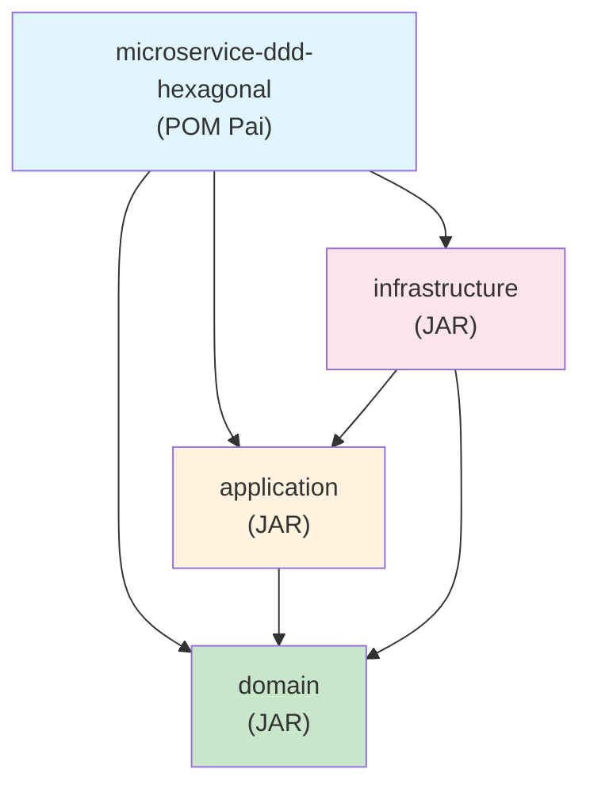
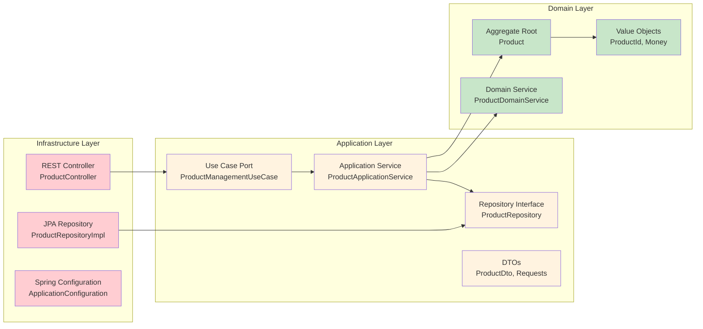

# Microserviço com Spring Boot, DDD e Arquitetura Hexagonal


Este projeto demonstra a implementação de um microserviço utilizando Spring Boot, princípios de Domain-Driven Design (DDD) e Arquitetura Hexagonal, organizado em módulos Maven separados.

## Estrutura do Projeto

O projeto está dividido em três módulos principais:

```
microservice-ddd-hexagonal/
├── pom.xml                           # POM pai do projeto
├── domain/                           # Módulo de Domínio
│   ├── pom.xml
│   └── src/main/java/com/example/domain/
│       ├── model/                    # Entidades e Value Objects
│       │   ├── Product.java          # Agregado raiz
│       │   ├── ProductId.java        # Value Object para ID
│       │   ├── ProductStatus.java    # Enum de status
│       │   └── Money.java            # Value Object para valores monetários
│       └── service/                  # Serviços de domínio puros
│           └── ProductDomainService.java
├── application/                      # Módulo de Aplicação
│   ├── pom.xml
│   └── src/main/java/com/example/application/
│       ├── service/                  # Serviços de aplicação
│       │   └── ProductApplicationService.java
│       ├── dto/                      # Objetos de transferência de dados
│       │   ├── ProductDto.java
│       │   ├── CreateProductRequest.java
│       │   └── UpdateProductRequest.java
│       ├── usecase/                  # Interfaces de casos de uso
│       │   └── ProductManagementUseCase.java
│       └── repository/               # Interfaces de repositório
│           └── ProductRepository.java
└── infrastructure/                   # Módulo de Infraestrutura
    ├── pom.xml
    └── src/main/
        ├── java/com/example/infrastructure/
        │   ├── MicroserviceApplication.java  # Classe principal do Spring Boot
        │   ├── configuration/
        │   │   └── ApplicationConfiguration.java
        │   └── adapter/
        │       ├── web/                      # Adaptadores web
        │       │   ├── ProductController.java
        │       │   └── ProductUseCaseAdapter.java
        │       └── persistence/              # Implementações de persistência
        │           ├── ProductJpaEntity.java
        │           ├── ProductJpaRepository.java
        │           └── ProductRepositoryImpl.java
        └── resources/
            ├── application.yml               # Configurações de desenvolvimento
            ├── application-prod.yml          # Configurações de produção
            └── data.sql                      # Dados de exemplo
```

## Relações de Dependência entre Módulos

### Diagrama de Dependências Maven



### Fluxo de Dependências (Arquitetura Hexagonal)



### Regras de Dependência

#### ✅ **Dependências Permitidas:**

**1. Infrastructure → Application**
- `ProductController` depende de `ProductManagementUseCase`
- `ProductUseCaseAdapter` implementa `ProductManagementUseCase`
- `ApplicationConfiguration` configura beans da aplicação

**2. Infrastructure → Domain**
- `ProductRepositoryImpl` implementa `ProductRepository`
- `ProductJpaEntity` mapeia para `Product`
- Spring Boot starter executa a partir da infraestrutura

**3. Application → Domain**
- `ProductApplicationService` usa `Product`, `ProductDomainService`, `ProductRepository`
- `ProductDto` converte de/para entidades do domínio
- Use cases orquestram operações do domínio

#### ❌ **Dependências Proibidas:**

**1. Domain → Application** (NUNCA)
- Domínio não pode conhecer camada de aplicação
- Mantém pureza das regras de negócio

**2. Domain → Infrastructure** (NUNCA)
- Domínio não pode depender de frameworks
- Inversão de dependência através de interfaces

**3. Application → Infrastructure** (NUNCA)
- Aplicação não pode conhecer detalhes de implementação
- Usa abstrações (ports) definidas na própria camada

### Benefícios desta Estrutura

**1. Inversão de Dependências**
```
Infraestrutura ──► Aplicação ──► Domínio
     ↑                            ↑
     └────────────────────────────┘
```
- Fluxo de controle: Infrastructure → Application → Domain
- Fluxo de dependências: Infrastructure → Application → Domain
- Domain define interfaces, Infrastructure implementa

**2. Isolation por Camadas**
- **Domain**: Zero dependências externas, apenas Java puro
- **Application**: Depende apenas do Domain + Spring Context
- **Infrastructure**: Depende de Application, Domain + Frameworks

**3. Facilita Testes**
- Domain: Testes unitários puros
- Application: Mocks de repositories
- Infrastructure: Testes de integração

## Conceitos Implementados

### Domain-Driven Design (DDD)

**DDD** é uma abordagem de desenvolvimento de software que coloca o foco no domínio central e na lógica de domínio, baseando o design em um modelo do domínio.

#### **Conceitos DDD Implementados:**

**1. Aggregate Root (Agregado Raiz)**
- **`Product`**: Entidade principal que mantém consistência e controla acesso ao agregado
- Encapsula regras de negócio e invariantes
- Único ponto de entrada para modificações no agregado

**2. Value Objects**
- **`ProductId`**: Identifica unicamente um produto, imutável e sem identidade própria
- **`Money`**: Representa valores monetários com validações, encapsula moeda e valor
- **`ProductStatus`**: Enum que representa estados válidos do produto
- Características: imutáveis, comparados por valor, não possuem identidade

**3. Repository Interface (in Application Layer)**
- **Interface `ProductRepository`**: Definida na camada de aplicação, abstrai persistência
- **Implementação `ProductRepositoryImpl`**: Na infraestrutura, implementa detalhes técnicos
- Mantém o domínio completamente livre de dependências externas

**4. Domain Services**
- **`ProductDomainService`**: Lógica de domínio pura que não pertence naturalmente a uma entidade
- Coordena operações entre múltiplas entidades com dados fornecidos como parâmetros
- Mantém regras de negócio complexas sem dependências externas

**5. Application Services**
- **`ProductApplicationService`**: Orquestra casos de uso e coordena operações
- Não contém lógica de negócio, apenas orquestração
- Ponto de entrada para operações de aplicação

### Arquitetura Hexagonal (Ports & Adapters)

**Arquitetura Hexagonal** isola a lógica de negócio dos detalhes externos através de portas e adaptadores, permitindo que a aplicação seja testável e independente de frameworks.

#### **Conceitos Hexagonais Implementados:**

**1. Inbound Ports (Portas de Entrada)**
- **`ProductManagementUseCase`**: Define contratos dos casos de uso
- Representa o que a aplicação pode fazer
- Independente de como será chamado (REST, GraphQL, etc.)

**2. Outbound Ports (Portas de Saída)**
- **`ProductRepository`**: Define contratos para persistência
- Abstrai detalhes de como os dados são armazenados
- Permite trocar implementações sem afetar o domínio

**3. Primary Adapters (Adaptadores Primários)**
- **`ProductController`**: Adaptador REST que recebe requisições HTTP
- **`ProductUseCaseAdapter`**: Implementa as portas de entrada
- Traduzem requisições externas para chamadas do domínio

**4. Secondary Adapters (Adaptadores Secundários)**
- **`ProductRepositoryImpl`**: Implementa persistência com JPA
- **`ProductJpaEntity`**: Entidade JPA para mapeamento objeto-relacional
- Implementam as portas de saída com tecnologias específicas

### Benefícios da Implementação

**1. Separação de Responsabilidades**
- **Domínio**: Apenas regras de negócio puras
- **Aplicação**: Orquestração e casos de uso
- **Infraestrutura**: Detalhes técnicos e frameworks

**2. Inversão de Dependências**
- Domínio não depende de infraestrutura
- Interfaces definidas no domínio, implementadas na infraestrutura
- Facilita testes e manutenção

**3. Testabilidade**
- Domínio testável sem dependências externas
- Fácil criação de mocks para interfaces
- Testes unitários rápidos e confiáveis

**4. Flexibilidade Tecnológica**
- Fácil troca de banco de dados, frameworks web, etc.
- Adição de novos adaptadores sem modificar o domínio
- Evolução independente das camadas

## Princípios DDD Implementados

### 1. **Entidades e Value Objects**
- `Product`: Agregado raiz com identidade e ciclo de vida próprio
- `ProductId`: Value Object para identificação única
- `Money`: Value Object para valores monetários com validações
- `ProductStatus`: Enum representando estados do produto

### 2. **Repository Interface (in Application Layer)**
- Interface `ProductRepository` na camada de aplicação
- Implementação `ProductRepositoryImpl` na infraestrutura
- Domínio completamente livre de dependências de persistência

### 3. **Serviços de Domínio**
- `ProductDomainService`: Lógica de negócio pura que não pertence a uma entidade específica
- Recebe dados como parâmetros, sem dependências externas
- Coordena operações complexas entre entidades

### 4. **Agregados**
- `Product` como agregado raiz com regras de negócio encapsuladas

## Arquitetura Hexagonal

### Portas (Ports)
- **Inbound Ports**: `ProductManagementUseCase` - Define casos de uso
- **Outbound Ports**: `ProductRepository` - Define contratos de persistência

### Adaptadores (Adapters)
- **Primary Adapters**: `ProductController`, `ProductUseCaseAdapter`
- **Secondary Adapters**: `ProductRepositoryImpl`

## Tecnologias Utilizadas

- **Java 21**
- **Spring Boot 3.1.5**
- **Spring Data JPA**
- **H2 Database** (desenvolvimento)
- **PostgreSQL** (produção)
- **Maven** (gerenciamento de dependências)
- **Jakarta Validation** (validações)


## Como Executar

### Pré-requisitos
- Java 21 ou superior
- Maven 3.6 ou superior

### Comandos

```bash
# Compilar o projeto
mvn clean compile

# Executar testes
mvn test

# Executar a aplicação
mvn spring-boot:run -pl infrastructure

# Empacotar a aplicação
mvn clean package
```

### Executar com Docker (opcional)
```bash
# Criar imagem Docker
docker build -t microservice-ddd .

# Executar container
docker run -p 8080:8080 microservice-ddd
```

## API Endpoints

### Produtos

| Método | Endpoint | Descrição |
|--------|----------|-----------|
| GET | `/api/v1/products` | Listar todos os produtos |
| GET | `/api/v1/products/{id}` | Buscar produto por ID |
| GET | `/api/v1/products/active` | Listar produtos ativos |
| GET | `/api/v1/products/search?name={name}` | Buscar produtos por nome |
| POST | `/api/v1/products` | Criar novo produto |
| PUT | `/api/v1/products/{id}` | Atualizar produto |
| PATCH | `/api/v1/products/{id}/stock/add?quantity={qty}` | Adicionar estoque |
| PATCH | `/api/v1/products/{id}/stock/remove?quantity={qty}` | Remover estoque |
| PATCH | `/api/v1/products/{id}/activate` | Ativar produto |
| PATCH | `/api/v1/products/{id}/deactivate` | Desativar produto |
| DELETE | `/api/v1/products/{id}` | Excluir produto |
| GET | `/api/v1/products/statistics` | Estatísticas do inventário |

### Exemplo de Requisição

```json
POST /api/v1/products
{
  "name": "iPhone 15 Pro",
  "description": "Latest iPhone with advanced features",
  "price": 1199.99,
  "currency": "USD",
  "stockQuantity": 100
}
```

## Perfis de Ambiente

### Desenvolvimento (padrão)
- Banco H2 em memória
- Console H2 habilitado
- Logs detalhados
- Dados de exemplo carregados automaticamente

### Produção (`-Dspring.profiles.active=prod`)
- PostgreSQL
- Logs otimizados
- Configurações de segurança

## Monitoramento

### Actuator Endpoints
- `/actuator/health` - Status da aplicação
- `/actuator/info` - Informações da aplicação
- `/actuator/metrics` - Métricas da aplicação

### Console H2 (apenas desenvolvimento)
- URL: `http://localhost:8080/h2-console`
- JDBC URL: `jdbc:h2:mem:testdb`
- User: `sa`
- Password: `password`

## Benefícios da Arquitetura

### 1. **Separação de Responsabilidades**
- Domínio: Regras de negócio puras
- Aplicação: Orquestração de casos de uso
- Infraestrutura: Detalhes técnicos

### 2. **Testabilidade**
- Domínio independente de frameworks
- Fácil criação de testes unitários
- Mocks simples para dependências externas

### 3. **Flexibilidade**
- Fácil troca de tecnologias (banco, framework web)
- Adição de novos adaptadores sem impacto no domínio
- Evolução independente dos módulos

### 4. **Manutenibilidade**
- Código organizado e bem estruturado
- Dependências claras entre camadas
- Princípios SOLID aplicados
- Arquitetura facilmente validável via revisão de código

## Próximos Passos

- [x] ~~Aplicar arquitetura hexagonal com portas na camada de aplicação~~
- [x] ~~Tornar domínio completamente puro~~
- [ ] Implementar testes unitários e de integração
- [ ] Considerar ferramentas de validação arquitetural (ArchUnit, SonarQube, etc.)
- [ ] Adicionar autenticação e autorização
- [ ] Implementar eventos de domínio
- [ ] Adicionar cache com Redis
- [ ] Implementar circuit breaker
- [ ] Adicionar métricas customizadas
- [ ] Containerização com Docker
- [ ] CI/CD pipeline

## Destaques Arquiteturais

### ✅ **Arquitetura Hexagonal Completa**
- **Domínio Puro**: Zero dependências externas, apenas Java
- **Portas na Aplicação**: Inversão de dependência adequada
- **Adaptadores na Infraestrutura**: Implementação de detalhes técnicos

### ✅ **DDD Rigoroso**
- **Agregado Raiz**: Product com regras de negócio encapsuladas
- **Value Objects**: ProductId e Money imutáveis e ricos em comportamento
- **Serviços de Domínio**: Lógica pura sem side effects

### ✅ **Qualidade Arquitetural**
- **Separação Clara**: Responsabilidades bem definidas entre camadas
- **Testabilidade**: Domínio independente e testável
- **Flexibilidade**: Fácil evolução e manutenção
- **Documentação**: Arquitetura bem documentada e exemplificada

### ✅ **Qualidade de Código**
- **Separação Clara**: Responsabilidades bem definidas
- **Testabilidade**: Domínio independente e testável
- **Flexibilidade**: Fácil evolução e manutenção

---

**Este projeto serve como referência para implementação de microserviços com arquitetura limpa, princípios DDD rigorosos e separação clara de responsabilidades.**