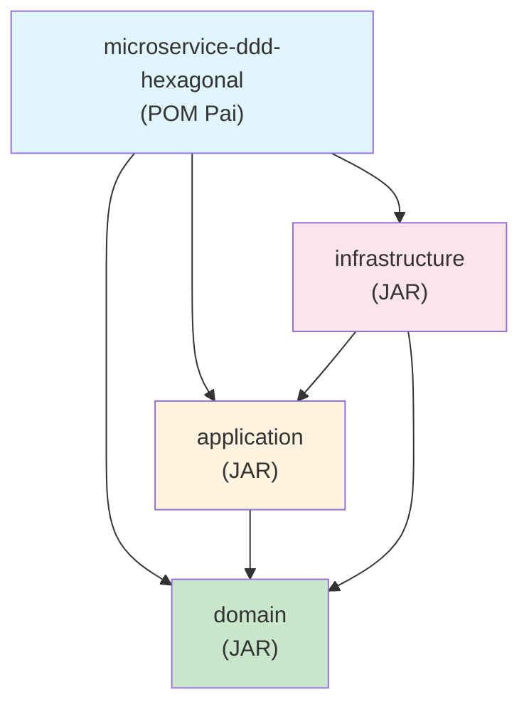
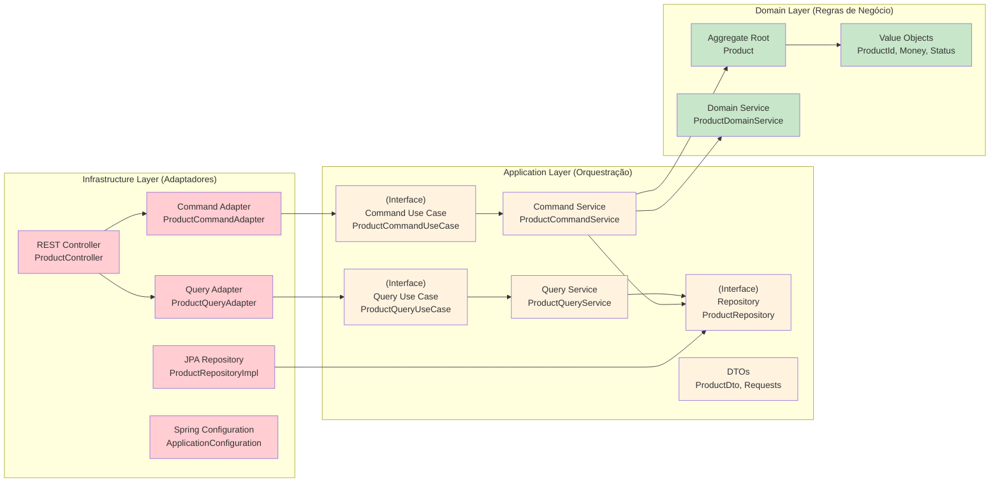

# Microserviço com Spring Boot, DDD e Arquitetura Hexagonal


Este projeto demonstra a implementação de um microserviço utilizando Spring Boot, princípios de Domain-Driven Design (DDD) e Arquitetura Hexagonal, organizado em módulos Maven separados.

## 🎯 Objetivos do Projeto

- **Separação clara** entre lógica de negócio e detalhes técnicos
- **Domínio puro** sem dependências de frameworks
- **Testabilidade** independente da infraestrutura
- **Flexibilidade** para mudanças tecnológicas
- **Manutenibilidade** através de fronteiras arquiteturais claras

## 📁 Estrutura de Módulos

O projeto está dividido em três módulos principais seguindo os princípios da Arquitetura Hexagonal:

> 📚 **Para documentação detalhada de cada módulo, consulte:**
> - [🏛️ **Domain Module**](domain/README.md) - Lógica de negócio pura e conceitos DDD
> - [⚙️ **Application Module**](application/README.md) - Casos de uso, CQRS e orquestração
> - [🔧 **Infrastructure Module**](infrastructure/README.md) - Adaptadores, Spring Boot e integrações técnicas

```
microservice-ddd-hexagonal/
├── pom.xml                    # POM pai do projeto
├── domain/                    # 🏛️ Lógica de negócio pura (DDD)
├── application/               # ⚙️ Casos de uso e orquestração (CQRS)
└── infrastructure/            # 🔧 Adaptadores e frameworks (Spring Boot)
```

## Relações de Dependência entre Módulos

### Diagrama de Dependências Maven



### Fluxo de Dependências (Arquitetura Hexagonal + CQRS)



## 🏗️ Arquitetura de Alto Nível

### Fluxo de Dependências

```
Infraestrutura ──► Aplicação ──► Domínio
     ↑                            ↑
     └────────────────────────────┘
```

**Princípios Arquiteturais:**
- **Domain**: Zero dependências externas, apenas Java puro
- **Application**: Define portas (use cases) e orquestração (CQRS)
- **Infrastructure**: Implementa adaptadores para web e persistência

### Padrões Implementados
- **Hexagonal Architecture** (Ports & Adapters)
- **Domain-Driven Design** (DDD)
- **Command Query Responsibility Segregation** (CQRS)
- **Dependency Inversion Principle**

## 🚀 Quick Start

### Pré-requisitos
- **Java 21** ou superior
- **Maven 3.6** ou superior
- IDE Java (IntelliJ IDEA, Eclipse, etc.)

### Comandos Essenciais

```bash
# Compilar o projeto
mvn clean compile

# Executar testes
mvn test

# Executar a aplicação
mvn spring-boot:run -pl infrastructure

# Empacotar
mvn clean package

# Executar com perfil de produção
mvn spring-boot:run -pl infrastructure -Dspring.profiles.active=prod
```

### Acesso à API
- **Base URL**: `http://localhost:8080/api/v1`
- **Console H2** (desenvolvimento): `http://localhost:8080/h2-console`
- **Health Check**: `http://localhost:8080/actuator/health`

## 📊 API Endpoints Principais

### Funcionalidades do Sistema
- **Gerenciamento de produtos** (CRUD)
- **Controle de inventário** (adicionar/remover estoque)
- **Gerenciamento de status** (ativar/desativar produtos)
- **Busca e filtragem** de produtos
- **Estatísticas** de inventário

### Endpoints REST

| Método | Endpoint | Descrição |
|--------|----------|------------|
| GET | `/api/v1/products` | Listar todos os produtos |
| GET | `/api/v1/products/{id}` | Buscar produto por ID |
| GET | `/api/v1/products/active` | Listar produtos ativos |
| GET | `/api/v1/products/search?name={name}` | Buscar produtos por nome |
| POST | `/api/v1/products` | Criar novo produto |
| PUT | `/api/v1/products/{id}` | Atualizar produto |
| PATCH | `/api/v1/products/{id}/stock/add?quantity={qty}` | Adicionar estoque |
| PATCH | `/api/v1/products/{id}/stock/remove?quantity={qty}` | Remover estoque |
| PATCH | `/api/v1/products/{id}/activate` | Ativar produto |
| PATCH | `/api/v1/products/{id}/deactivate` | Desativar produto |
| DELETE | `/api/v1/products/{id}` | Excluir produto |
| GET | `/api/v1/products/statistics` | Estatísticas do inventário |

**Exemplo de Request:**
```json
POST /api/v1/products
{
  "name": "iPhone 15 Pro",
  "description": "Latest iPhone with advanced features",
  "price": 1199.99,
  "currency": "USD",
  "stockQuantity": 100
}
```

## 🚀 Tecnologias Utilizadas

- **Java 21** - LTS version with modern features
- **Spring Boot 3.1.5** - Framework principal
- **Spring Data JPA** - Persistência
- **H2 Database** (desenvolvimento) / **PostgreSQL** (produção)
- **Maven** - Build tool e gerenciamento de dependências
- **Jakarta Validation** - Validações
- **Spring Boot Actuator** - Monitoramento

## 🌐 Ambientes

### Desenvolvimento (padrão)
- Banco H2 em memória
- Console H2: `http://localhost:8080/h2-console`
- Logs detalhados
- Dados de exemplo carregados automaticamente

### Produção
```bash
mvn spring-boot:run -pl infrastructure -Dspring.profiles.active=prod
```
- PostgreSQL
- Logs otimizados
- Configurações de segurança

## ✨ Benefícios da Arquitetura

- **🎯 Separação Clara**: Domínio puro, aplicação CQRS, infraestrutura isolada
- **🧪 Testabilidade**: Domínio independente, fácil criação de mocks
- **🔄 Flexibilidade**: Fácil troca de tecnologias sem impacto no domínio
- **📈 Escalabilidade**: Comandos e consultas otimizados independentemente
- **🔧 Manutenibilidade**: Código organizado com dependências claras

## 📋 Próximos Passos

### ✅ Implementado
- Arquitetura hexagonal com portas na camada de aplicação
- Domínio completamente puro
- Padrão CQRS (Command Query Responsibility Segregation)
- Adaptadores especializados para comandos e consultas
- Separação de serviços de aplicação por responsabilidade

### 🕰️ Em Desenvolvimento
- [ ] **Testes Unitários Abrangentes**
  - Testes de domínio (entidades, value objects, serviços)
  - Testes de aplicação (casos de uso, serviços CQRS)
  - Testes de integração (adaptadores, repositórios)

- [ ] **Segurança e Autenticação**
  - JWT authentication
  - Autorização com Spring Security
  - Rate limiting e throttling

- [ ] **Eventos de Domínio**
  - Domain events para comunicação entre agregados
  - Event sourcing para auditoria
  - Integration events para comunicação entre microserviços

- [ ] **Resiliência e Monitoramento**
  - Circuit breaker com Resilience4j
  - Health checks customizados
  - Métricas customizadas com Micrometer
  - Distributed tracing com Sleuth/Zipkin

### 📪 Documentação Modular
Para detalhes de implementação, consulte os READMEs específicos:
- [🏛️ Domain](domain/README.md): DDD, agregados, value objects
- [⚙️ Application](application/README.md): CQRS, casos de uso, portas
- [🔧 Infrastructure](infrastructure/README.md): Spring Boot, JPA, adaptadores

---

**Este projeto serve como referência para implementação de microserviços com arquitetura limpa, princípios DDD rigorosos, padrão CQRS e separação clara de responsabilidades.**